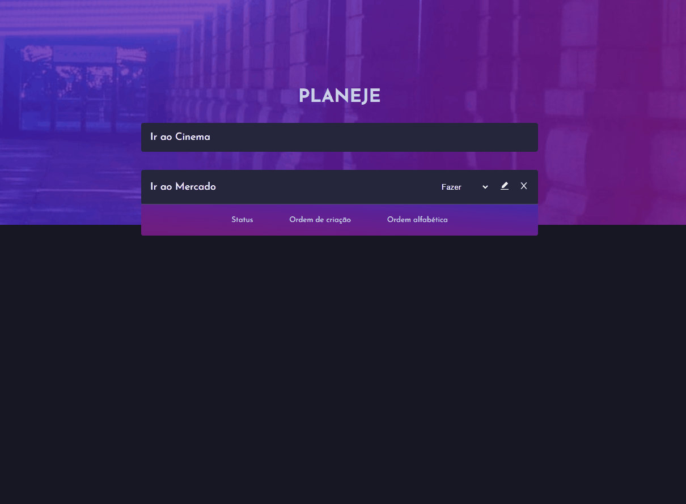

# Planeje

Planeje é uma aplicação fullstack que possibilita o gerenciamento de tarefas onde é possível criar, editar, atualizar ou excluir tarefas de maneira independente.

## Demo



## Backend

O Backend da aplicação consiste em uma api que utiliza os princípios de arquitetura REST, com 5 endspoints, utilizando o bando de dados POSTGRES e documentada com swagger, com 100% de cobertura de teste sendo esses de integração e unitários utilizando o método In Memory de testes e CI através do github actions e deploy no railway.

## Documentação

A Documentação completa da api feita com o swagger pode ser acessada através do link abaixo.

[Swagger](https://projete-production.up.railway.app/api-docs/)

Com o swagger é possível a interação com os 5 endspoints sendo possível testá-los obtendo exemplos e a repostas de forma independente.

## Frontend

O Frontend da aplicação conta com uma interface feita em react, e estilizada com styled-components, onde através da biblioteca de requisição axios, é possível executar e consumir as operações do crud, também é utilizado o layout respondível e RTL para testar a funcionalidade dos componentes.

## Aplicação

Link da aplicação Frontend com deploy feito no vercel já integrada com o Backend rodando no railway.

[Planeje](https://planeje.vercel.app/)

## Rodar Localmente

Para rodar a aplicação você pode escolher rodar através de um container no docker ou localmente com node.

<details>
<summary><b>Docker</b></summary>

## Pré-Requisitos

Para rodar a aplicação é necessário ter instalado corretamente o [Docker](https://docs.docker.com/get-docker/) e o [Docker-Compose](https://docs.docker.com/compose/install/).

## Rodando no Docker

Clone o projeto

```bash
  git clone git@github.com:fpdsjr/Projete.git
```

Navegue até o diretório do projeto

```bash
  cd Projete
```

Rode a aplicação no docker

```bash
  docker-compose up -d --build
```

Apos conclusão da montagem do container a aplicação vai estar disponível nos endereços abaixo:

```bash
  Backend: http://localhost:3333
  Frontend: http://localhost:3000
```

</details>

<details>
<summary><b>Node</b></summary>

## Pré-Requisitos

Para rodar a aplicação é necessário ter instalado o [Node](https://nodejs.org/en/) e um banco de dados funcionando [PostgreSQL](https://www.postgresql.org/)

## Rodando no Node

O Projeto conta com um repositório monorepo, então para tudo funcionar corretamente precisando ligar o Frontend e o Backend de maneira independente, siga os passos abaixo.

Clone o projeto

```bash
  git clone git@github.com:fpdsjr/Projete.git
```

Navegue até o diretório do projeto

```bash
  cd Projete
```

Entre no diretório server para ligar o Backend

```bash
  cd server
```

Instalando as dependências

```bash
  yarn
```

Rodando Localmente

```bash
  yarn start
```

Pronto agora temos o Backend rodando

```bash
  Backend: http://localhost:3333
```

##Vamos para a parte do Frontend.

Volte de diretório para a raiz do projeto

```bash
  cd ..
```

Entre no diretório onde esta contido o frontend

```bash
  cd web
```

Instalando as dependências

```bash
  yarn
```

Ligando o frontend

```bash
  yarn start
```

Agora com o Frontend Ligado temos a aplicação funcionado já integrada com o Backend e funcionando

```bash
  Frontend: http://localhost:3000
```

</details>

## Rodando os testes

<details>
<summary><b>Frontend</b></summary>

Entre no diretório web

```bash
  cd web
```

Instalando as dependências

```bash
  yarn
```

Rodando os testes

```bash
  yarn test
```

</details>

<details>
<summary><b>Backend</b></summary>

Entre no diretório web

```bash
  cd server
```

Instalando as dependências

```bash
  yarn
```

Rodando os testes

```bash
  yarn test
```

</details>

## Tech Stack

#### Web

- React
- TypeScript
- React Hooks
- Custom Hooks
- Styled-Components
- Docker
- Axios
- Eslint
- Jest

#### Server

- Node
- TypeScript
- Express
- Prisma
- PostegreSQL
- Docker
- Swagger
- Eslint
- Jest
- Tsyringe

## Authors

- [Flavio junior](https://github.com/fpdsjr)
